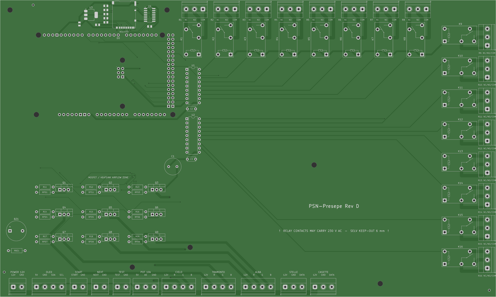
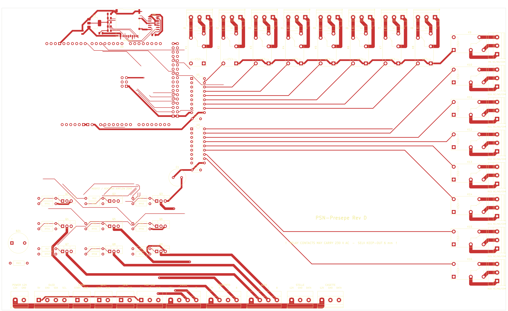
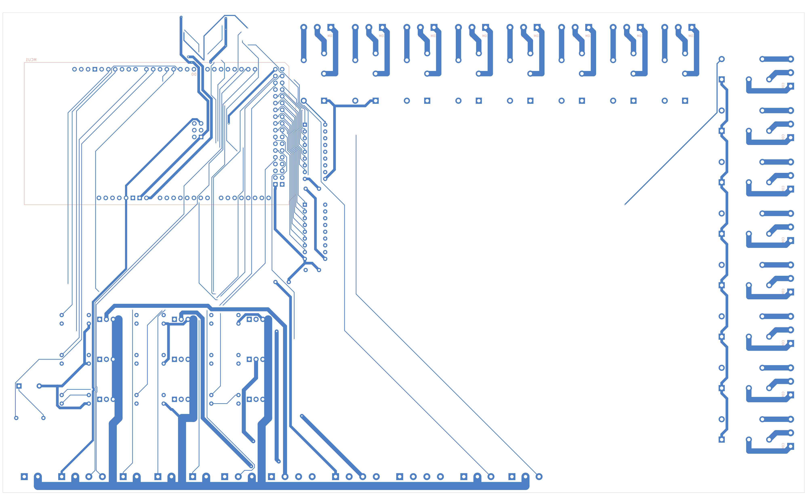

# PSN-Presepe — Rev D

*English · [Italiano](README.it.md)*

Arduino Mega 2560 controller for a modular 12 V nativity scene (*presepe*).

It runs a day/night cycle: **GIORNO → TRAMONTO → CREPUSCOLO → NOTTE → ALBA** (day → sunset → dusk → night → dawn). The cycle drives:

- three analog 12 V RGB strips: main sky, sunset side and dawn side;
- two addressable WS2811 chains: twinkling stars and house windows;
- 16 relays for motors, pumps and lamps.

Every scenography parameter can be changed from a `PRESEPE.INI` file on a microSD card, read at power-on.

This repository holds the complete Rev D project:

- the PCB (KiCad), with the scripts that generate and verify it;
- manufacturing files ready for a turnkey assembler;
- the firmware, with its tests;
- wiring documentation for building the controller on a breadboard without the PCB.

> **Status (2026-10-04).** The Rev D PCB passed every automated check below. It was ordered from PCBWay (turnkey assembly, see [manufacturing/pcbway-order-2026-10-04](manufacturing/pcbway-order-2026-10-04/README.md)). The physical board has **not been tested yet**. The firmware is built on the version tested on the breadboard, with the new SD configuration added on top.



## Contents

1. [Repository layout](#1-repository-layout)
2. [How the controller works](#2-how-the-controller-works)
3. [The Rev D board](#3-the-rev-d-board)
4. [Board connectors (terminal pinout)](#4-board-connectors-terminal-pinout)
5. [Arduino Mega pin map](#5-arduino-mega-pin-map)
6. [Power, currents and fusing](#6-power-currents-and-fusing)
7. [Wiring the loads](#7-wiring-the-loads)
8. [Breadboard / prototype build without the PCB](#8-breadboard--prototype-build-without-the-pcb)
9. [Firmware](#9-firmware)
10. [SD-card configuration (PRESEPE.INI)](#10-sd-card-configuration-presepeini)
11. [PCB design rules and verification](#11-pcb-design-rules-and-verification)
12. [Ordering the board](#12-ordering-the-board)
13. [Rebuilding everything](#13-rebuilding-everything)
14. [Known limitations and open points](#14-known-limitations-and-open-points)
15. [Safety](#15-safety)
16. [Revision history](#16-revision-history)

---

## 1. Repository layout

```
build.sh                        one-command rebuild + verification of PCB and firmware
build/
  scripts/                      PCB generator, router glue, DRC, independent checkers, exporters
  data/                         reference netlist/pad data and the stored routing session (routing.ses)
  lib/PSN_RevD.pretty/          custom footprints (Arduino Mega shield, JLC tooling hole)
kicad/                          KiCad 7 project: board, rules, schematic (+PDF), local footprint library
manufacturing/                  Gerbers, drill maps, BOMs, pick-and-place files, assembly instructions, 1:1 print
  pcbway-order-2026-10-04/      FROZEN copy of the files actually sent to PCBWay (+ SHA256SUMS, order notes)
previews/                       renders of the board (KiCad layers and photo-style Gerber renders)
reports/                        DRC, independent board/Gerber checks, schematic parity, footprint checks
firmware/
  PSN-Presepe/                  the whole firmware in one sketch (PSN-Presepe.ino), example PRESEPE.INI, prebuilt HEX, Windows flasher
  tools/                        fw_compile.sh, flash.sh (Linux/macOS), run_tests.sh, test_config.cpp
simulation/                     Wokwi simulation of the Rev D wiring (diagram, custom RGB chip, bundle script)
.github/workflows/firmware.yml  CI: parser tests + firmware compile
```

Everything in `kicad/`, `manufacturing/` (except the frozen order folder), `previews/` and `reports/` is generated by `./build.sh`. Edit the scripts, not the generated files (see [section 13](#13-rebuilding-everything)).

## 2. How the controller works

| Element | Hardware | Behaviour |
|---|---|---|
| **CIELO** (sky) | 12 V common-anode RGB strip, 3 PWM MOSFET channels | Warm day light, full white at mid-day, fades to dark at night, warm dawn glow |
| **TRAMONTO** (sunset, left) | 12 V RGB strip, 3 PWM channels | Orange/red swell during sunset only, completely off otherwise |
| **ALBA** (dawn, right) | 12 V RGB strip, 3 PWM channels | Lighter warm swell during dawn only |
| **STELLE** (stars) | 12 V WS2811 chain (default 50 pixels) | Random stars appear at dusk, twinkle individually at night, fade at dawn |
| **CASETTE** (houses) | 12 V WS2811 chain (default 50 pixels) | Warm window light from mid-sunset to mid-dawn, gentle per-house flicker |
| **Relays 1–16** | Omron G5Q-1, potential-free COM/NO/NC contacts | Switched on/off at programmable points of each phase |
| **Controls** | START/STOP, NEXT, TEST buttons, speed potentiometer | Pause/resume, jump to next phase, output test, choose 1 of 3 cycle lengths |
| **OLED** | 0.96" SSD1306 128×64 I2C | Phase, progress, cycle length, SD status, test steps (optional) |
| **Buzzer** | passive piezo / magnetic buzzer | Key beeps and a start-up melody (optional) |
| **microSD** | push-push slot on the board edge | `PRESEPE.INI` with all parameters; without a card the built-in defaults are used |

Default phase boundaries, as % of the cycle: TRAMONTO 40 %, CREPUSCOLO 50 %, NOTTE 55 %, ALBA 85 %. ALBA ends at 100 %, where the next GIORNO begins.

Default cycle lengths: 1, 3 or 5 minutes, chosen by the potentiometer.

## 3. The Rev D board

- 300 × 180 mm, 2 layers, FR-4 1.6 mm, **2 oz copper**, HASL, tented vias.
- The board is a shield: it plugs onto an **Arduino Mega 2560 R3**, which sits underneath. The Mega headers are mounted on the bottom side.
- All field wiring goes through **5.08 mm screw terminals** on the board edges.
- Single **12 V** input. The Mega is powered through VIN, and the microSD gets its own 3.3 V LDO.

| Block | Parts |
|---|---|
| 12 V input | J1, bulk capacitor C1 470 µF |
| RGB drivers | 9 × IRLZ44N logic-level MOSFETs (Q1–Q9), 100 Ω gate resistor + 100 kΩ pull-down each, low-side switching |
| Relay drivers | 2 × ULN2803A (U1, U2), freewheel diodes inside (COM pin to +12 V), 16 × Omron G5Q-1 DC12 |
| Relay outputs | JR1–JR16, 3-pole COM / NO / NC, isolated 230 V AC area (see [section 11](#11-pcb-design-rules-and-verification)) |
| microSD | Hirose DM3AT-SF-PEJM5 push-push with card detect, AMS1117-3.3 LDO from +12 V, 74LVC125A level shifter for SCK/MOSI/CS, 10 kΩ pull-ups |
| Buzzer | BZ1 (passive, 7.6 mm pitch) through 220 Ω from D6 |
| Controls / OLED / pot | Terminals only; the parts are off-board |

| Top (copper + silk) | Bottom (copper + silk) |
|---|---|
|  |  |

Assembly drawing: [previews/PSN-Presepe-Mega-RevD-assembly.png](previews/PSN-Presepe-Mega-RevD-assembly.png). Schematic: [kicad/PSN-Presepe-Mega-RevD-schematic.pdf](kicad/PSN-Presepe-Mega-RevD-schematic.pdf). The schematic is generated from the board and uses global net labels, so read it together with the tables below.

## 4. Board connectors (terminal pinout)

Pin 1 is the square pad. The function of each pin is also printed on the silkscreen next to every terminal.

### Bottom edge, left to right

| Terminal | Pin 1 | Pin 2 | Pin 3 | Pin 4 | Use |
|---|---|---|---|---|---|
| **J1** POWER 12V | +12 V | GND | | | Power supply input |
| **J_OLED** | +5 V (Mega) | GND | SDA (D20) | SCL (D21) | OLED display |
| **J_START** | D22 | GND | | | START/STOP button (normally open) |
| **J_NEXT** | D23 | GND | | | NEXT button (normally open) |
| **J_TEST** | D24 | GND | | | TEST button (normally open) |
| **J_POT** | +5 V (Mega) | A0 (wiper) | GND | | External 10 kΩ linear potentiometer |
| **J_CIELO** | +12 V | R− | G− | B− | Sky RGB strip (common anode) |
| **J_TRAMONTO** | +12 V | R− | G− | B− | Sunset RGB strip |
| **J_ALBA** | +12 V | R− | G− | B− | Dawn RGB strip |
| **J_STELLE** | +12 V | GND | DATA (D5) | | WS2811 stars |
| **J_CASETTE** | +12 V | GND | DATA (D8) | | WS2811 houses |

### Top and right edges (relay area)

| Terminal | Pin 1 | Pin 2 | Pin 3 |
|---|---|---|---|
| **JR1 … JR16** | COM | NO (closed when the relay is on) | NC (closed when the relay is off) |

JR1–JR8 run along the top edge and JR9–JR16 down the right edge. Relay *n* is driven by Mega pin D(24+*n*): relay 1 = D25 … relay 16 = D40.

**microSD (J_SD)** sits on the top edge at x ≈ 95 mm. The card goes in from the board edge and sticks out about 4–5 mm when inserted, so an enclosure needs a slot there.

## 5. Arduino Mega pin map

| Mega pin | Function | Notes |
|---|---|---|
| D2, D3, D4 | CIELO R, G, B (PWM) | Q1–Q3. D4 uses Timer0, so it is 8-bit PWM only |
| D5 | STELLE WS2811 data | |
| D6 | Buzzer | through RBZ1 220 Ω |
| D7, D11, D12 | TRAMONTO R, G, B (PWM) | Q4–Q6, 16-bit timers |
| D8 | CASETTE WS2811 data | |
| D20 / D21 | I2C SDA / SCL | OLED address 0x3C |
| D22, D23, D24 | START, NEXT, TEST | `INPUT_PULLUP`; a button shorts the pin to GND |
| D25 … D40 | Relays 1 … 16 | HIGH = relay on (through the ULN2803A) |
| D44, D45, D46 | ALBA R, G, B (PWM) | Q7–Q9, 16-bit timer |
| D49 | microSD card detect | LOW = card inserted (shown on the serial log only) |
| D50 / D51 / D52 / D53 | microSD MISO / MOSI / SCK / CS | hardware SPI |
| A0 | Speed potentiometer | |
| VIN | +12 V from the board | the Mega is powered through the shield |
| 5V | to J_OLED / J_POT only | |

Free pins: D9, D10, D13, D14–D19, D41–D43, D47, D48, A1–A15. D9, D10 and D13 can also do PWM.

## 6. Power, currents and fusing

- **Supply:** one 12 V DC switching power supply. Size it from the sum of:
  - the RGB strips at full white;
  - the WS2811 chains (up to roughly 0.7 W per pixel at full white for common 12 V WS2811 strings; check yours);
  - the relay coils (all 16 on < 0.6 A);
  - the Mega with OLED (≈ 0.1 A).
- **Fuse** the 12 V supply output at no more than **8 A**. The 3 mm, 2 oz +12 V / GND trunks carry about 9 A with a 10 °C temperature rise.
- **RGB channels:** each colour channel is a 1.5 mm, 2 oz trace through an IRLZ44N. Keep each channel at **4 A or less**. A typical 1 m 5050 RGB strip uses about 0.4 A per colour.
- **Relay contacts:** 10 A / 250 V AC resistive, according to the relay rating. The contact traces are doubled on both layers (2 mm, 2 oz each), so the relay is the limit, not the copper.
  - Motors and other inductive loads draw an inrush current: keep a good margin.
  - DC loads above about 30 V are not recommended, because DC arcs are hard for these contacts to break.
- **Small-signal loads:** the G5Q-1 has power contacts with silver alloy, made to switch amperes. Very small currents, such as logic inputs (a few mA), are not switched reliably. Use a signal relay with gold contacts for those; see the Omron datasheet for the minimum load.
- **Mega supply:** the Mega regulates the 12 V on VIN down to 5 V. Only the OLED and the potentiometer use that 5 V, so its regulator stays cool. **Never connect +12 V to the Mega 5V pin or to any I/O pin.**
- **USB and 12 V together are fine:** the Mega switches between its power sources automatically. With USB only, the Mega, OLED and potentiometer work. The relays, strips and microSD have no power, because they run from 12 V.

## 7. Wiring the loads

### Analog RGB strips (CIELO / TRAMONTO / ALBA)

The strips are **common-anode** (common +12 V). The board switches the negative R, G and B returns.

```
J_CIELO pin 1 (+12 V) ──► strip +12V (common)
J_CIELO pin 2 (R−)    ──► strip R
J_CIELO pin 3 (G−)    ──► strip G
J_CIELO pin 4 (B−)    ──► strip B
```

Do not connect a strip's R/G/B to +12 V or GND directly.

### WS2811 chains (STELLE / CASETTE)

```
J_STELLE pin 1 (+12 V) ──► chain +12V
J_STELLE pin 2 (GND)   ──► chain GND
J_STELLE pin 3 (DATA)  ──[330 Ω, recommended, at the chain input]──► chain DIN
```

The board has no series resistor on DATA. Put a 330–470 Ω resistor in the data wire, close to the first pixel. This matters most with long wires.

For long chains, also feed +12 V at the far end of the chain. Set the number of pixels in `[STELLE] numero` and `[CASETTE] numero`. The maximum is 100 per chain.

### Relays (potential-free contacts)

Each relay is an independent changeover contact, so every relay can switch a different circuit. For example, relay 1 can switch 230 V AC while relay 2 switches a 12 V pump.

Inside one relay, COM, NO and NC must belong to the **same** circuit.

Example: a 230 V AC motor on relay 1.

```
Mains L (phase, brown) ──► JR1 pin 1 COM
JR1 pin 2 NO ────────────► motor wire 1
Mains N (neutral, blue) ─► motor wire 2           (does not go through the board)
Mains PE (green/yellow) ─► motor earth, if any    (does not go through the board)
```

If the Arduino resets or misbehaves when a motor switches off, fit an RC snubber across the motor: 100 Ω + 100 nF, X2-rated for 250 V AC.

### Buttons, potentiometer, OLED

- **Buttons:** normally-open push buttons between each Dxx terminal pin and the GND pin next to it. No resistors are needed.
- **Potentiometer:** 10 kΩ linear (B10K). One end to pin 1 (+5 V), wiper to pin 2 (A0), other end to pin 3 (GND). If the knob turns the "wrong" way, set `[CICLO] pot_invertito`.
- **OLED:** an SSD1306 128×64 I2C module at address 0x3C, wired 5 V / GND / SDA / SCL.
  - Module pin orders differ: some are VCC-GND-SCL-SDA, others GND-VCC-SCL-SDA. Check the labels printed on your module.
  - Keep the I2C cable under about 1 m.

## 8. Breadboard / prototype build without the PCB

Every block of the PCB can be rebuilt on a breadboard or perfboard with the same Mega pins, so the same firmware runs unchanged. Common rules:

- One 12 V supply for the loads.
- The Mega is powered from USB or from 12 V on VIN.
- **Arduino GND and the 12 V supply 0 V must be connected together.** This common ground is required for the WS2811 data and the MOSFET gates.

### 8.1 One RGB colour channel (repeat 9 times)

Pins: D2/D3/D4 for CIELO, D7/D11/D12 for TRAMONTO, D44/D45/D46 for ALBA.

```
Mega Dx ──[100 Ω]──┬──► Gate   IRLZ44N  (TO-220 pinout: G - D - S, seen from the front)
                   │
                [100 kΩ]
                   │
GND ───────────────┴──► Source
Drain ───────────────► strip colour wire (R−, G− or B−)
+12 V ───────────────► strip common +12V
```

You can use ready-made MOSFET modules instead. If a module is active-low, set `[COLORI] pwm_invertito = 1`.

### 8.2 Relays

On the PCB, a ULN2803A sinks the coil current, and its internal diodes clamp the coil when it switches off:

```
Mega D25..D32 ──► ULN2803A #1 inputs 1..8 (pins 1..8)      Mega D33..D40 ──► ULN2803A #2 inputs 1..8
ULN2803A pin 9 = GND, pin 10 (COM) = +12 V
ULN2803A output n (pin 19-n) ──► relay coil −         relay coil + ──► +12 V
```

With off-the-shelf 4- or 8-channel relay modules, connect IN1…IN16 to D25…D40. Most modules are **active-low**: set `[RELE] logica = bassa` in `PRESEPE.INI`. Power the module coils from a suitable supply, not from the Mega 5 V pin.

### 8.3 WS2811 chains

```
Mega D5 ──[330 Ω]──► STELLE DIN        Mega D8 ──[330 Ω]──► CASETTE DIN
12 V supply + / 0 V ──► chain +12V / GND, with 0 V common with Arduino GND
```

### 8.4 Controls, OLED, buzzer

```
D22 ──[START]── GND      D23 ──[NEXT]── GND      D24 ──[TEST]── GND
+5V ── pot end   A0 ── pot wiper   GND ── pot other end
OLED: VCC → 5V, GND → GND, SDA → D20, SCL → D21
D6 ──[220 Ω]──► passive buzzer + ; buzzer − ──► GND     (optional)
```

### 8.5 microSD

Use a standard 5 V "microSD card adapter" module, the kind with its own 3.3 V regulator and level shifter. A bare 3.3 V breakout without a level shifter will be damaged.

```
module VCC → 5V    GND → GND    MISO → D50    MOSI → D51    SCK → D52    CS → D53
```

Card detect (D49) is optional. If the module has no CD pin, leave D49 unconnected. The firmware only uses CD for the serial log, and it decides whether a card is present by trying to read it.

## 9. Firmware

Source: **one file**, `firmware/PSN-Presepe/PSN-Presepe.ino` (comments in Italian). Target: Arduino Mega 2560. The same file is compiled by the Arduino IDE, by `arduino-cli` and by Wokwi. The `PRESEPE.INI` reader sits between the `// ==== CONFIG BEGIN ====` and `// ==== CONFIG END ====` markers; `firmware/tools/run_tests.sh` extracts that block and tests it on a PC.

Libraries: Adafruit NeoPixel, Adafruit GFX, Adafruit SSD1306 (with Adafruit BusIO), Arduino SD; SPI and Wire come with the core. Versions used for the current HEX:

| Library | Version |
|---|---|
| NeoPixel | 1.15.5 |
| GFX | 1.12.6 |
| SSD1306 | 2.5.17 |
| BusIO | 1.17.4 |
| SD | 1.3.0 |

Size: 55.9 kB flash (22 %), 3.7 kB static RAM. The LED and OLED buffers are allocated at run time, which leaves about 3 kB free.

### Build

- **Arduino IDE:** open `firmware/PSN-Presepe/PSN-Presepe.ino`, select *Arduino Mega or Mega 2560*, then Upload.
- **Command line:**

  ```sh
  arduino-cli core install arduino:avr
  arduino-cli lib install "Adafruit NeoPixel" "Adafruit GFX Library" "Adafruit SSD1306" "SD"
  firmware/tools/fw_compile.sh                       # -> firmware/PSN-Presepe/build/PSN-Presepe.ino.hex
  firmware/tools/run_tests.sh                        # 54 host-side checks of the INI reader and colour tappe
  ```

The sketch declares its prototypes explicitly, so it does not depend on the IDE's automatic prototype generation.

### Flash the prebuilt HEX

- **Windows:** copy `PSN-Presepe.ino.hex` and `flash-windows.bat` into one folder and run the BAT. It downloads arduino-cli on first use and auto-detects the Mega.
- **Linux / macOS:** `firmware/tools/flash.sh [port]`.

Flash with the 12 V supply off: during the upload the outputs toggle, and without 12 V no relay can switch. The Mega can stay plugged into the board, as long as the USB plug fits ([section 14](#14-known-limitations-and-open-points)).

### Operation

**Boot:**
1. Load the defaults.
2. Read `/PRESEPE.INI` from the SD card, or `/PRESEPE.TXT` if the first is missing.
3. Show the OLED splash.
4. Show the SD status screen:

   | OLED message | Meaning |
   |---|---|
   | `PRESEPE.INI OK` (or `PRESEPE.TXT OK`) | file read, no errors |
   | `INI CON ERRORI` | file read with errors; shows the number of errors and the first bad line |
   | `MANCA PRESEPE.INI` | card present, neither file found |
   | `SD ASSENTE` | no card |

5. Run the self-test (about 22 s; can be disabled), with an optional melody.
6. Start the cycle, running or paused according to `partenza`.

**Buttons:**

| Button | Action |
|---|---|
| **START/STOP** | Pause or resume; resumes exactly where it stopped. In TEST mode it exits TEST. |
| **NEXT** | Jump to the start of the next phase. |
| **TEST** | Enter TEST mode, then step through 34 tests: each colour of each strip, star and house colours, everything together, then relays 1–16 one at a time, with their names if defined. The cycle time is frozen while in TEST. |
| **Potentiometer** | Selects one of the three cycle lengths; the change is applied once the knob settles. |

**Serial monitor** (115200 baud): prints the whole active configuration at boot, including every relay event, followed by a periodic status line (`debug_ms`).

### Simulation

The firmware runs unchanged in the Wokwi simulator, with the Rev D wiring: RGB bars, stars, houses, relays as LEDs, OLED, buttons, potentiometer and a microSD card. Paste `PSN-Presepe.ino` into Wokwi's `sketch.ino` as it is. Wokwi does not accept `.ini` files, so the configuration goes in a project file named `PRESEPE.TXT`; the firmware reads it when `PRESEPE.INI` is missing. See [simulation/README.md](simulation/README.md).

## 10. SD-card configuration (PRESEPE.INI)

Copy [`firmware/PSN-Presepe/PRESEPE.INI`](firmware/PSN-Presepe/PRESEPE.INI) to the **root** of a microSD or microSDHC card (2–32 GB, FAT16/FAT32). Cards of 64 GB and more come formatted exFAT, which the Arduino SD library cannot read, so reformat them as FAT32 first.

The card is read **once, at power-on**. If `PRESEPE.INI` is missing, the firmware looks for `PRESEPE.TXT` with the same content (handy for Wokwi, or when Windows saved the file as `.txt`). The example file contains exactly the built-in defaults; every key is explained in Italian in its comments.

| Section | Keys |
|---|---|
| `[CICLO]` | `durata1..3` (s, 10–86400), `pot_min`, `pot_max`, `pot_invertito`, `partenza = marcia / pausa` |
| `[FASI]` | start % of `tramonto`, `crepuscolo`, `notte`, `alba` (must be strictly increasing) |
| `[RELE]` | `logica = alta / bassa`, `nome1..16` (max 12 characters), `forza1..16 = auto / on / off`, `evento = PHASE, RELAY, ON/OFF, %` (up to 64) |
| `[CIELO]`, `[TRAMONTO]`, `[ALBA]` | `tappa = PHASE, %, R, G, B [, morbida / lineare]` (up to 20 per strip), see below |
| `[COLORI]` | `lum_cielo / lum_tramonto / lum_alba` (%), `gamma`, `pwm_invertito` |
| `[STELLE]` | `numero` (≤ 100), `attive`, `lum_min / lum_max`, `livello_notte`, `scintillio_min / max` (ms), `colore` (tint %) |
| `[CASETTE]` | `numero` (≤ 100, 0 = off), `colore`, `accendi = PHASE, %`, `spegni = PHASE, %` (may wrap past the end of the cycle), `fuoco` (0–100), `dissolvenza_ms` |
| `[SISTEMA]` | `buzzer`, `beep_hz`, `beep_ms`, `melodia_avvio`, `autotest_avvio`, `oled`, `debug_ms` |

Relay events are persistent: a relay keeps its state until its next event. Relays can be named by number (1–16), by name, or as `Grp_GG_RR`, where relay = (GG − 1) × 4 + RR. The first valid `evento` line replaces the whole default table.

Example: a mill motor on relay 1 runs from 10 % of GIORNO until night falls.

```ini
[RELE]
nome1  = Mulino
evento = GIORNO, Mulino, ON, 10
evento = NOTTE,  Mulino, OFF, 0
```

### RGB strip colours: "tappe" (keyframes)

The colour of each analog strip over the cycle is a list of **tappe** (stops) in its own section, `[CIELO]`, `[TRAMONTO]` or `[ALBA]`. A tappa says: *at this point of the cycle the strip has exactly this colour*. Between two consecutive tappe the firmware fades gradually from one colour to the next.

```ini
tappa = PHASE, % of the phase, R, G, B [, curve]
```

- **PHASE, %:** where the tappa is. For example, `TRAMONTO, 38` is 38 % into the sunset phase. Decimals use a dot: `33.33`.
- **R, G, B:** the colour at that point, 0–255. `0, 0, 0` is off.
- **curve** (optional) is how the strip *arrives* at this tappa from the previous one:
  - `morbida` (default): smooth start and smooth arrival (smoothstep), the natural fade used so far;
  - `lineare`: constant speed over the whole stretch.

Rules:
- Write the tappe in time order, from GIORNO to ALBA. A tappa that goes back in time is skipped and counted as an error.
- The list wraps around: after the last tappa the strip fades towards the first tappa of the next cycle.
- **Two tappe at the same point make an instant change** (a step): the strip reaches the first colour and restarts from the second.
- To keep a strip off for a stretch, put a `0, 0, 0` tappa at the start and another at the end of that stretch.
- Up to 20 tappe per strip. A single tappa means a fixed colour for the whole cycle.
- If a section contains at least one valid tappa, the file's tappe replace **all** the default tappe of that strip. Strips without tappe in the file keep their defaults.

The default tappe reproduce the historical curves of the firmware. For example, the sunset strip:

```ini
[TRAMONTO]
tappa = TRAMONTO,   0,   0,  0,  0     ; off until the sunset starts
tappa = TRAMONTO,   0,  18, 10,  4     ; step: switches on, faint and warm
tappa = TRAMONTO,  38, 155, 92, 16     ; orange peak
tappa = TRAMONTO,  82,  16, 16, 16     ; fades to a faint white
tappa = TRAMONTO, 100,   0,  0,  0     ; off at the end of the sunset, until the next cycle
```

To add an intermediate colour, for example a red stage between the orange peak and the faint white, add a tappa in between: `tappa = TRAMONTO, 60, 140, 30, 10`.

The default tappe were checked against the previous hard-coded firmware at 1,000,000 points of the cycle:
- the sunset and dawn strips differ by at most 1 step out of 255 (float rounding), at 15 points out of a million;
- the sky strip differs by 1 step out of 255 at 0.5 % of the points;
- the only larger difference (10 steps) is at the single instant of the dawn "step" at 38 %, where the old and the new code round the boundary differently.

None of this is visible.

How errors are handled:
- A bad line is skipped and counted, and that key keeps its default.
- Non-increasing phase percentages or an unusable potentiometer range revert to the defaults.

## 11. PCB design rules and verification

### Isolation of the relay contacts (230 V AC)

| Distance | Rule | Measured |
|---|---|---|
| Relay contact copper ↔ any low-voltage copper (SELV) | ≥ 6.0 mm | 6.47 mm |
| Contacts of different relays | ≥ 5.0 mm | 5.23 mm |
| COM / NO / NC of the same relay | ≥ 2.0 mm | 2.15 mm |
| Relay contacts ↔ board edge | ≥ 3.0 mm | passed |
| Relay contacts ↔ non-mains holes | ≥ 6.0 mm | 8.7 mm |

There are no vias on mains nets.

The 48 contact nets (COM/NO/NC × 16) each connect only one relay pin to its terminal, so 230 V never reaches the rest of the board. This is checked automatically.

### Automated checks (`reports/`)

| Check | Result |
|---|---|
| KiCad DRC with net classes and custom isolation rules | **0 violations, 0 unconnected** |
| Positive controls: each isolation rule forced to an impossible value, one run per rule | all 4 rules fire, so they are active |
| `verify.py`: independent geometric check with shapely, without KiCad | **all checks passed** (clearances per class pair, islands, widths, netlist vs Rev B + documented changes, relay/ULN/MOSFET pinouts, microSD wiring vs firmware pins) |
| `verify_gerbers.py`: independent check of the Gerber X2 / Excellon files | **all checks passed** |
| Schematic ↔ PCB (kicad-cli netlist) | 363 / 363 pins match |
| `check_mega_footprint.py` | 32 / 32 UNO R3 pins and 4 / 4 holes coincide with KiCad's official footprint (0.000 mm); Mega-only holes and headers match the published Mega R3 coordinates |
| `compare_gerbers.py` vs the files sent to PCBWay | geometry identical, primitive by primitive |

Minimum copper spacing on the board is 0.202 mm (7.95 mil).

## 12. Ordering the board

### PCBWay (turnkey, used for the first order)

1. **Assembly → SMT/THT**. Choose turnkey, single pieces, **both sides**.
   - Unique parts: 20; SMD parts: 12; BGA/QFP: 0; through-hole parts: 86.
   - Accept alternatives for passives only.
2. **PCB:**
   - 300 × 180 mm, 2 layers, FR-4, 1.6 mm, 6/6 mil (PCBWay raises it to 8/8 for 2 oz), min hole 0.3 mm;
   - HASL lead-free, tented vias, **2 oz**, remove product number.
3. **Upload:**

   | Field | File |
   |---|---|
   | Gerbers | `manufacturing/PSN-Presepe-Mega-RevD-gerbers.zip` |
   | BOM | `…-BOM-PCBWay.csv` (manufacturer part numbers and assembly notes) |
   | Centroid | `…-Centroid-PCBWay.csv` (includes MCU1 on the bottom side) |
   | Other files | `…-Assembly-Instructions.pdf` (bottom-side Mega headers, ICSP holes left empty, polarity notes) |

4. Wait for the review (*audit*) and the DFM. The component cost is quoted only after the review.

The exact files and settings of the 2026-10-04 order are frozen in `manufacturing/pcbway-order-2026-10-04/`.

### JLCPCB (alternative)

Gerbers + `…-BOM-JLCPCB.csv` + `…-CPL-JLCPCB.csv`. Tooling holes: *Added by Customer* (TH1–TH3 are on the board).

JLCPCB assembles one side only, so **the Mega headers have to be soldered by hand.**

### Before ordering a new revision

Print `…-1to1-A3-top.pdf` at 100 % and check the real parts on it.

## 13. Rebuilding everything

Requirements (versions used):

| Tool | Version | Purpose |
|---|---|---|
| KiCad | 7.0.11 | Python `pcbnew` API and `kicad-cli` |
| Python | 3 | with `shapely`, `gerbonara`, `reportlab`, `Pillow` |
| `rsvg-convert` | | renders |
| `zip` | | Gerber archive |
| arduino-cli | 1.1.1 | with arduino:avr |
| C++11 compiler | | parser tests |
| Freerouting 2.2.4 + Java 25 | | only to route again from scratch |

```sh
./build.sh                    # everything into ./out (PCB replayed from build/data/routing.ses + firmware)
UPDATE_REPO=1 ./build.sh      # same, then refresh kicad/ manufacturing/ previews/ reports/ in the repo
REROUTE=1 FREEROUTING_JAR=/path/freerouting-2.2.4.jar JAVA=/path/java ./build.sh   # route again from scratch
SKIP_PCB=1 ./build.sh         # firmware only
```

How the PCB pipeline works (`build/scripts/pipeline.sh`):
1. Place every footprint from the reference netlist (`build_board.py`).
2. Write net classes and isolation rules (`make_rules.py`).
3. Pre-route the mains paths, power trunks and keep-outs (`route_mains.py`).
4. Autoroute with Freerouting, or replay the stored session.
5. Import the session (`import_ses.py`), finish the leftovers with an A* router (`complete_routes.py`), remove unused fan-out vias (`cleanup.py`), then run the final DRC.

`make_release.sh` then stamps and exports everything and runs all the independent checks. `package.sh` lays the result out like this repository.

The stored routing session makes the rebuild deterministic: a clean rebuild from this tree produces geometry identical to the ordered Gerbers. Freerouting itself is not deterministic, so routing again from scratch gives a different, but still checked, layout.

KiCad gives every board item a fresh internal ID (`tstamp`) on each build, so `kicad/*.kicad_pcb` shows large text diffs in git even when nothing changed. Judge a rebuild by `reports/` (especially `gerber-equivalence-vs-pcbway-order.txt`), not by the text diff.

KiCad 8–10 open the KiCad 7 files, but the scripts were written for the KiCad 7 Python API.

## 14. Known limitations and open points

- **USB plug clearance.** The Mega USB-B socket ends about 1.7 mm inside the edge of the shield, and the shield sits about 11 mm above the Mega. Bulky USB plugs may not seat fully. If that happens, use a slim plug, stacking headers, or unplug the Mega to flash it. There is no copper on the shield above the USB socket or the DC jack.
- **WS2811 data** has no series resistor on the board: add 330 Ω in the cable ([section 7](#7-wiring-the-loads)).
- **CIELO blue (D4)** is on Timer0, so it stays 8-bit PWM. TRAMONTO and ALBA (and CIELO R/G) are on 16-bit timers and could move to 10–12-bit PWM in a later firmware.
- **Minimum spacing** is 0.202 mm (7.95 mil), and PCBWay states 8 mil for 2 oz copper. The difference is 1 µm, far below the etching tolerance. It was flagged to PCBWay with the order.
- **ERC was not run.** `kicad-cli` 7 has no ERC; connectivity is proven by schematic ↔ PCB parity and by the independent checks instead.
- **Ordered Gerbers carry revision "C"** in the X2 `ProjectId` header attribute, a leftover title-block value. It is cosmetic, has no effect on fabrication, and is fixed in the scripts. See the frozen order folder.
- **Annotation warnings:** the `J_*` reference designators make KiCad report annotation warnings. They are harmless.
- **CI workflow** (`.github/workflows/firmware.yml`) is written but has not run on GitHub yet.

## 15. Safety

- The relay area (top and right edges) carries **mains voltage** whenever mains is wired to a terminal, even when the relay is off.
- Mount the board in a closed, insulating enclosure.
- Fuse the mains feed to the relays.
- Disconnect mains before touching the board.
- Keep mains and low-voltage wiring separated and in their own cable routes.
- Test new hardware with the relay contacts unconnected, or with low-voltage loads, first.
- Treat any low-voltage circuit wired to a relay next to a mains relay with the same care as the mains wiring.

## 16. Revision history

| Rev | Summary |
|---|---|
| A | First PCB version of the breadboard controller (reviewed, not produced). |
| B | Arduino Mega shield with relays, MOSFETs and terminals (previous repository version). |
| C | Production fixes: G5Q-1 NO/NC pins corrected, ULN2803A DIP-18 footprint, buzzer series resistor, 6 / 5 / 2 mm isolation, 3 mm power trunks, JLCPCB tooling holes, complete verification suite. |
| D | Push-push microSD with 3.3 V LDO and level shifter; firmware reads `PRESEPE.INI` at boot (with built-in defaults); on-board potentiometer replaced by terminal J_POT; CASETTE chain driven in the cycle; turnkey-assembly files for PCBWay. |

---

License: not chosen yet. Add a `LICENSE` file to define how PSN-Presepe may be reused.

By **Vanni Brutto**
